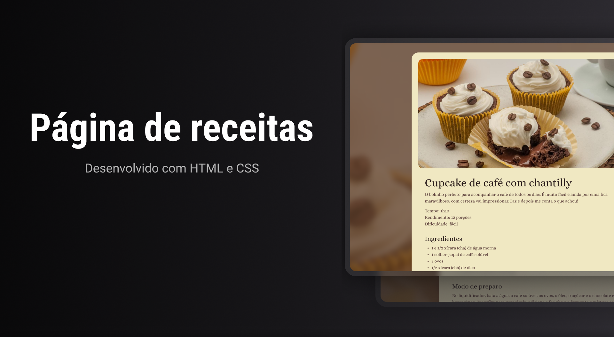

<h1 align="center"> Página de Receitas </h1>

Projeto de página de receitas desenvolvido para praticar fundamentos do desenvolvimento web. 

<a href="#projeto">Projeto</a>&nbsp;&nbsp;&nbsp;|&nbsp;&nbsp;&nbsp;
  <a href="#tecnologias-utilizadas">Tecnologias</a>&nbsp;&nbsp;&nbsp;|&nbsp;&nbsp;&nbsp;
  <a href="#funcionalidades">Funcionalidades</a>

 

## Projeto

A Página de receitas é uma interface desenvolvida para praticar fundamentos de HTML e CSS, com foco em estruturação semântica, organização visual do conteúdo e construção de uma apresentação clara e agradável para leitura de receitas.

## Tecnologias utilizadas

- HTML
- CSS
- Git
- GitHub
- Figma

## Funcionalidades

- Exibição organizada de receita
- Estrutura com título, imagem, ingredientes e modo de preparo
- Layout visual limpo e agradável
- Organização de conteúdo para leitura facilitada

## Projeto online

- [Acesse o projeto finalizado, online](https://felipe-hendrich.github.io/pagina-de-receitas-portfolio/)

## Aprendizados

Neste projeto, pratiquei:

- estruturação semântica de páginas com HTML
- estilização e organização visual com CSS
- hierarquia de informação para melhorar a leitura
- uso de Git e GitHub para versionamento

## Créditos

Projeto desenvolvido com base no conteúdo FullStack, da Rocketseat, com personalizações aplicadas durante a prática.